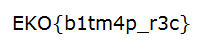

# Damaged (forensic 75)
It's a damaged bmp file. I use xxd to look at the file and find that its header is lost. So I make a BMP header for it.
```
'\x42\x4d\x36\x75\x00\x00\x00\x00\x00\x00\x36\x00\x00\x00'
```
Then the image is fixed.  

