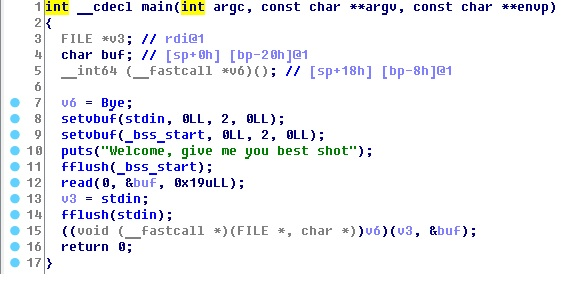
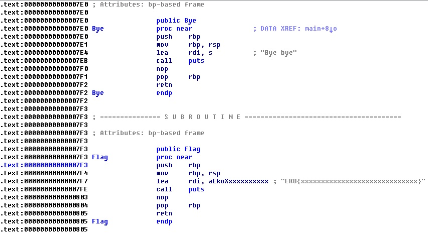

# Ultra Baby (pwn 25)
It's a simple stack overflow.  
We use ida to see the pseudo code of the binary file  
  

and observe that main stack allocate 32 bytes and the top 8 bytes are the address of function BYE, so the char buffer should be 24 bytes. But in the "read" function, it reads up to 25 bytes, which gives us a chance to tamper the stack. Another observation of the file is that a function FLAG is written but never called. We want to modify the memory storing BYE function address to the address of FLAG. The difference between BYE and FLAG address is the last byte. BYE: E0, FLAG: F3.  
So, the payload is simply ```'a'*24 + '\xf3'  ```
Whole command:  
```
python3 -c 'print("a"*24 + "\xf3")' | nc 9a958a70ea8697789e52027dc12d7fe98cad7833.ctf.site 55000
```
